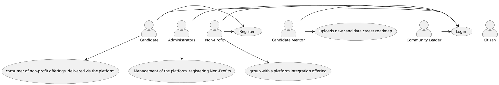

# Use Cases

## UC1

```plantuml
@startuml
skinparam actorStyle awesome
:Non-Profit: --> (group with a platform integration offering)
:Candidate: --> (Use)
"consumer of non-profit offerings, delivered via the platform" as (Use)
Administrators --> ( Management of the platform, registering Non-Profits)

:Candidate: ->(Login)
:Administrators: ->(Login)
:Non-Profit: ->(Login)

:Candidate: ->(Register)
:Non-Profit: ->(Register)

:Candidate Mentor: -> (uploads new candidate career roadmap)
:Candidate Mentor: -> (Login)
:Community Leader: -> (Login)
:Citizen:

@enduml
```

# UC2

TODO
