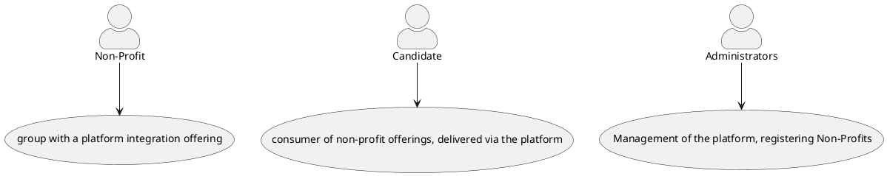

## Use Cases

 

**Actors**

```plantuml
@startuml
skinparam actorStyle awesome
:Non-Profit: --> (group with a platform integration offering)
:Candidate: --> (Use)
"consumer of non-profit offerings, delivered via the platform" as (Use)
Administrators --> ( Management of the platform, registering Non-Profits)
@enduml
```

**UC1: Register non-profits**

**UC2: Register candidate**
