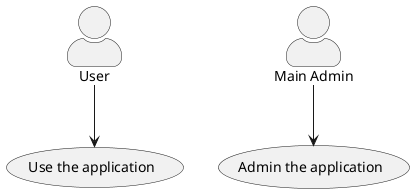

## Use Cases

 

**UC1: Bla**

```plantuml
@startuml
skinparam actorStyle awesome
:User: --> (Use)
"Main Admin" as Admin
"Use the application" as (Use)
Admin --> (Admin the application)
@enduml
```

**UC2: Bla**
